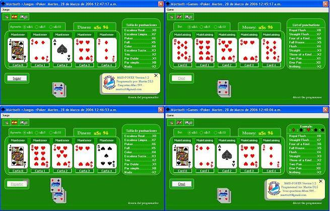

<div align="center">

## Super Poker


</div>

### Description

Game of poker , with Multilingue interface (English-Spanish).

Permitting to bend bet. I change of coin (Dollars-Euros-Pesos). Effects of sounds, and visual...

Show the use of archives of resources.
 
### More Info
 


<span>             |<span>
---                |---
**Submitted On**   |2006-03-28 00:36:08
**By**             |[Martin de los Santos](https://github.com/Planet-Source-Code/PSCIndex/blob/master/ByAuthor/martin-de-los-santos.md)
**Level**          |Beginner
**User Rating**    |5.0 (15 globes from 3 users)
**Compatibility**  |VB 6\.0
**Category**       |[Games](https://github.com/Planet-Source-Code/PSCIndex/blob/master/ByCategory/games__1-38.md)
**World**          |[Visual Basic](https://github.com/Planet-Source-Code/PSCIndex/blob/master/ByWorld/visual-basic.md)
**Archive File**   |[Super\_Poke1983553282006\.zip](https://github.com/Planet-Source-Code/martin-de-los-santos-super-poker__1-64833/archive/master.zip)

### API Declarations

```
Private Declare Function ShellExecute Lib "shell32.dll" Alias "ShellExecuteA" (ByVal hwnd As Long, ByVal lpOperation As String, ByVal lpFile As String, ByVal lpParameters As String, ByVal lpDirectory As String, ByVal nShowCmd As Long) As Long
Const SW_SHOWNORMAL = 1
```


